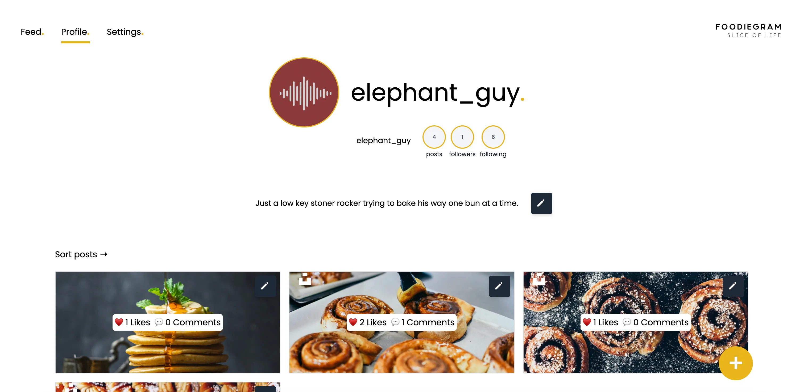
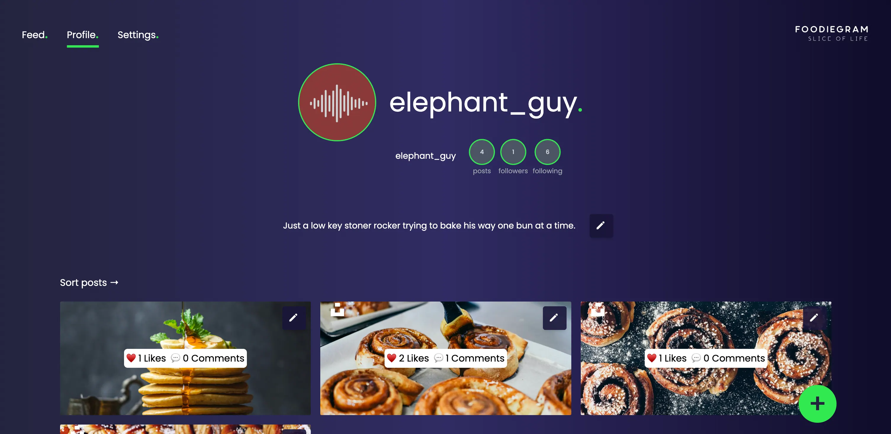

# 🍕 Foodiegram

**A social media application.**


_Lightmode_


_Darkmode_

## Description

Foodiegram is a social media app for "foodies", gathering food lovers from around the world to a social meeting arena, where the users can share their experiences and recommendations, recipes and tips.

## 🚀 Features

- **Feed** – View, create and like posts.
- **Search** – Sort and search in posts.
- **Profile** – Follow other users profiles. Update your own profile, create posts and edit/delete your posts.
- **User Authentication** – Create an account and log in. (restricted to these domains: @noroff.no, @stud.noroff.no)
  - Utilises localStorage for recognising the current logged in profile

## 🛠 Built With

- **Tailwind CSS** – styles
- **HTML & CSS** – structure and custom styles
- **JavaScript** – client-side logic
- **Node.js & Express.js** – backend routing

## Single page application routing (SPA)

This web app implements client-side routing for a smoother user experience.
The Express.js server is used to serve static files and provide a history fallback, so that direct links like; `/user/feed/`, load neatly without full page reload. The key for this approach is trying to create as smooth as possible experience for the user.

All required functionality — auth, crud, search/filters — are implemented in **pure JavaScript ES6** on the client side, in line with the [brief](docs/BRIEF.md)

### Github project

[Click to see Github project board](https://github.com/users/telecasteren/projects/2)<br/>
[Click to go to Github repo](https://github.com/telecasteren/social-app-noroff/tree/js2)

## Getting Started

### 1. Installation

#### Clone the repository:

```bash
git clone https://github.com/telecasteren/social-app-noroff.git
cd social-app-noroff
```

#### Switch to the correct branch (js2)

```bash
git switch js2
```

### 2. Prerequisites

- Node.js latest version -
  [Node.js](https://nodejs.org/en/download)

- Express.js v4:

```bash
npm install express@4.18.2
```

This is what's handling the routing(navigation) in the app.<br/>
[SPA](<#single-page-application-routing-(SPA)>) routing for updating content and browser URL without page reload.<br/>

--> Instead of navigating to a new HTML page, the routing system intercepts URL changes and dynamically renders different components or views on the same page.

**Then install the dependencies:**

```bash
npm install
```

This will install:

- Tailwind CSS (frontend styles)
- Live Server (static frontend preview)
- [Concurrently](https://www.npmjs.com/package/concurrently)
- Other required dependencies

### 3. Run the app

To start both the backend server and Tailwind, run:

```bash
npm run dev
```

You will see this in the console outcome:</br>
_Server is running on http://localhost:5500_

Now, open it in your preferred browser and get to testing!

### Issues when running

If you're experiencing any issue running the app, check the following:

- You are on the correct repository branch (js2)
- That port 5500 is not occupied ( localhost:5500 )
- You've installed Express.js v4
- You've run `npm install`

**--> If you still have issues, try running:**

```bash
npm install express@4.18.2
rm -rf node_modules package-lock.json
npm install
```

**Then run the app and server with** `npm run dev`

---

### All available scripts

- npm run dev – _runs the full project for development (starts Tailwind CSS watcher and server concurrently)_
- npm run build – _builds (compiles and minifies) the Tailwind CSS for production<br/>***NOTE! Does not handle routing***_
- npm run frontend – _serves the public/ folder locally with live-server for a static preview.<br/>***NOTE! Does not handle routing***_
- npm run tailwind – _starts Tailwind CSS in watch mode for development (rebuilds on file changes)<br/>***NOTE! Does not handle routing***_

### Testing the app

After cloning the repo and running it, you can test the app from a user perspective:

- Creating a test user within the valid email domain: noroff.no or stud.noroff.no

## ⭐ Contributing

**Right now I'm not looking for contributors, as this is a school project.**</br>
When contributing becomes available, see guidelines and more about it here:
[CONTRIBUTING.md](docs/CONTRIBUTING.md).

## 👨🏼‍💻 Contact me

Portfolio [telecasteren.com](https://telecasternilsen.com)

Github [@telecasteren](https://github.com/telecasteren)

LinkedIn [Tele Caster Nilsen](www.linkedin.com/in/tele-caster-nilsen-7002b9249)

## License

Under no licence p.t.

## 🫶 Acknowledgments

- Noroff Social API for posts and users content

### Under a free licence on Unsplash, some of the images used are by these creators:

#### **AVATAR IMAGES**

- [rayul @ Unsplash](https://unsplash.com/@rayul)
- [ayo-ogunseinde @ Unsplash](https://unsplash.com/@armedshutter)
- [ian-dooley @ Unsplash](https://unsplash.com/@iandooley)
- [toa-heftiba @ Unsplash](https://unsplash.com/@heftiba)
- [ivana-cajina @ Unsplash](https://unsplash.com/@von_co)
- [rafaella-mendes-diniz @ Unsplash](https://unsplash.com/@rafaellamendesdiniz)

#### **POST IMAGES**

- [rayul @ Unsplash](https://unsplash.com/@rayul)
- [chad-montano @ Unsplash](https://unsplash.com/@briewilly)
- [casey-lee @ Unsplash](https://unsplash.com/@caseylee)
- [brooke-lark @ Unsplash](https://unsplash.com/@brookelark)
- [anh-nguyen @ Unsplash](https://unsplash.com/@nguyentuananh)
- [adam-jaime @ Unsplash](https://unsplash.com/@adamjaime)
- [joseph-gonzalez @ Unsplash](https://unsplash.com/@gonzalez)
- [victoria-shes @ Unsplash](https://unsplash.com/@sheshoots)
- [adam-jaime @ Unsplash](https://unsplash.com/@adamjaime)
- [shenggeng-lin @ Unsplash](https://unsplash.com/@shenggeng-lin)
- [alex-munsell @ Unsplash](https://unsplash.com/@alex-munsell)
- [emy @ Unsplash](https://unsplash.com/@emy)
- [cody-chan @ Unsplash](https://unsplash.com/@cody-chan)
- [heather-barnes @ Unsplash](https://unsplash.com/@heather-barnes)
- [kobby-mendez @ Unsplash](https://unsplash.com/@kobby-mendez)
- [otto-norin @ Unsplash](https://unsplash.com/@otto-norin)
- [nguyen-dang-hoang-nhu @ Unsplash](https://unsplash.com/@nguyen-dang-hoang-nhu)

### ℹ️ Resources

[Typewriter effect](https://css-tricks.com/snippets/css/typewriter-effect/)</br>
[Typewriter library](https://www.typeitjs.com/)</br>
[IsoDateString to human readable](https://www.geeksforgeeks.org/how-to-format-javascript-date-as-yyyy-mm-dd/)</br>
[Truncate long strings](https://stackoverflow.com/questions/1199352/smart-way-to-truncate-long-strings)
